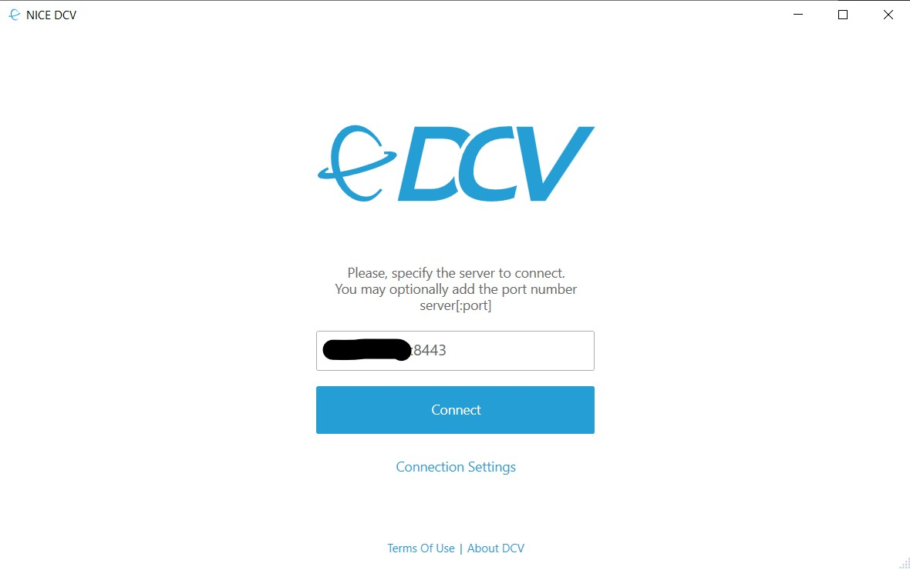
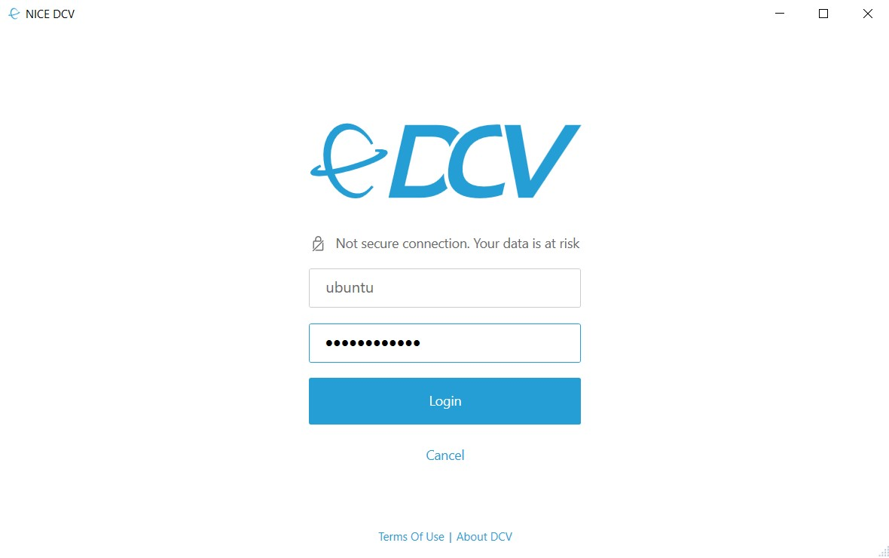
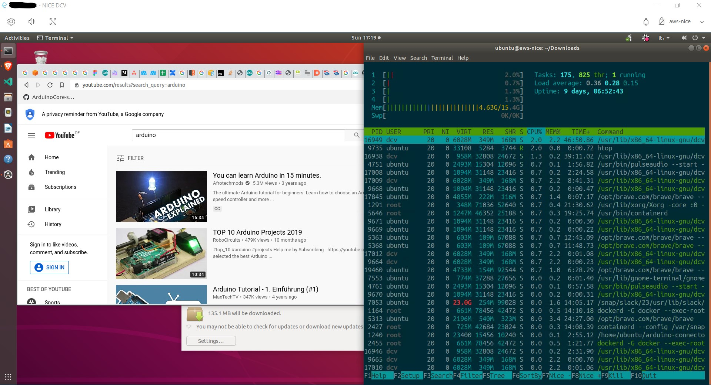
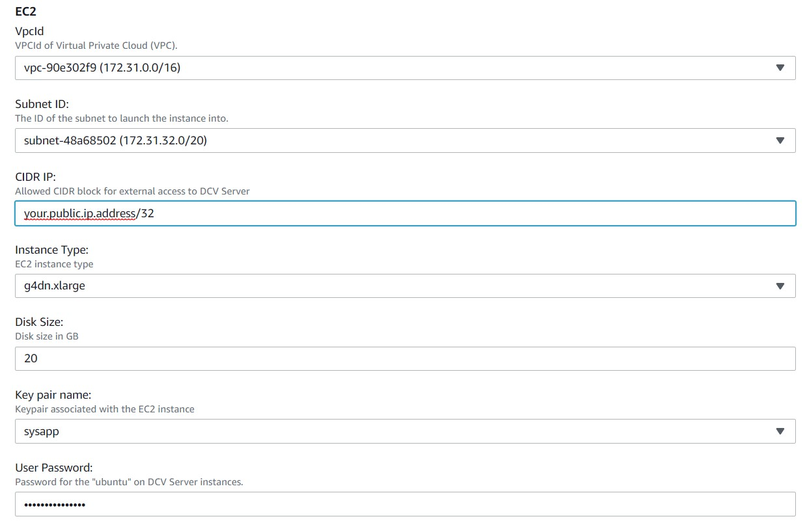

# aws-nice-dcv-config
AWS NICE DCV config files

This is the dir usually in `/etc/dcv` containing all the [AWS NICE DCV Server](https://aws.amazon.com/hpc/dcv/) config, more
docs is available at the official [AWS NICE Documentation Portal](https://docs.aws.amazon.com/dcv/index.html)

It has my private config, they are here for reference for everyone who wants to play with AWS NICE.
If you want to contact me I am [@mastrolinux](https://twitter.com/mastrolinux) on Twitter

## How to install the AMI for AWS Marketplace

You can install [Ubuntu 18.04 by using the using my AMI on the AWS Marketplace](https://aws.amazon.com/marketplace/pp/B088P8WCBV/)

To install the AMI you will need to allow the license (free from AWS) to be fetched from a specific S3 repo.

You must have specific information to be able to connect to the server. 
The Ubuntu Desktop server's IP address or host name.
The NICE DCV Server is started on port 8443.
Default username is "ubuntu".
1. Make sure the instance security groups allow inbound traffic to TCP port 8443, and 22 (for SSH Access,).
2. Make sure the instance has the role to access the license file. [Follow the AWS DCV Setting Up License Guide](https://docs.aws.amazon.com/dcv/latest/adminguide/setting-up-license.html)
3. Connect to your remote machine with `ssh -i <your-pem-key> ubuntu@<public-dns>`
4. Set the password for the ubuntu with sudo passwd ubuntu. This is the password you will use to log in DCV. For more info follow the [AWS DCV Admin Guide on Managing Sessions](https://docs.aws.amazon.com/dcv/latest/adminguide/managing-sessions.html)
5. Install the native NICE DCV Client for you OS, detailed guides are available for
    * [Windows Client](https://docs.aws.amazon.com/dcv/latest/userguide/client-windows.html)
    * [macOS Client](https://docs.aws.amazon.com/dcv/latest/userguide/client-mac.html)
    * [Linux Client](https://docs.aws.amazon.com/dcv/latest/userguide/client-linux.html)
    * [Web Browser](https://docs.aws.amazon.com/dcv/latest/userguide/client-web.html) (max resolution is 1920x1080)
6. Connect to your remote machine with the NICE DCV native client by using the public IP or via web client at the URL https://<public_dns>:8443.



7. Use the username ubuntu and the choosen password


8. Enjoy a full-featured Ubuntu 18.04 Desktop



9. Look at the incredible performance of glxgears, the only bottleneck can be the bandwidth.

```
glxgears -info
Running synchronized to the vertical refresh.  The framerate should be
approximately the same as the monitor refresh rate.
GL_RENDERER   = Tesla T4/PCIe/SSE2
GL_VERSION    = 4.6.0 NVIDIA 440.43
GL_VENDOR     = NVIDIA Corporation
GL_EXTENSIONS = ...
VisualID 38, 0x26
46352 frames in 5.0 seconds = 9270.255 FPS
45307 frames in 5.0 seconds = 9060.985 FPS
45673 frames in 5.0 seconds = 9134.472 FPS
46038 frames in 5.0 seconds = 9207.584 FPS
47839 frames in 5.0 seconds = 9567.710 FPS
48198 frames in 5.0 seconds = 9639.454 FPS
```

## Using The CloudFormation Template

The new CloudFormation Template version has the ability to automatically configure the NICE DCV license for you (it is freely provided by Amazon AWS).

During the setup you can choose some parameters:

    * VPC
    * Subnet
    * CIDR Block for accessing the VM
    * Instance Type
    * Key pair (for SSH access)
    * Password (for the default ubuntu user)

The template will automatically install the NICE DCV License by accessing an S3 file provided by Amazon AWS.

You can select the options as in the 
